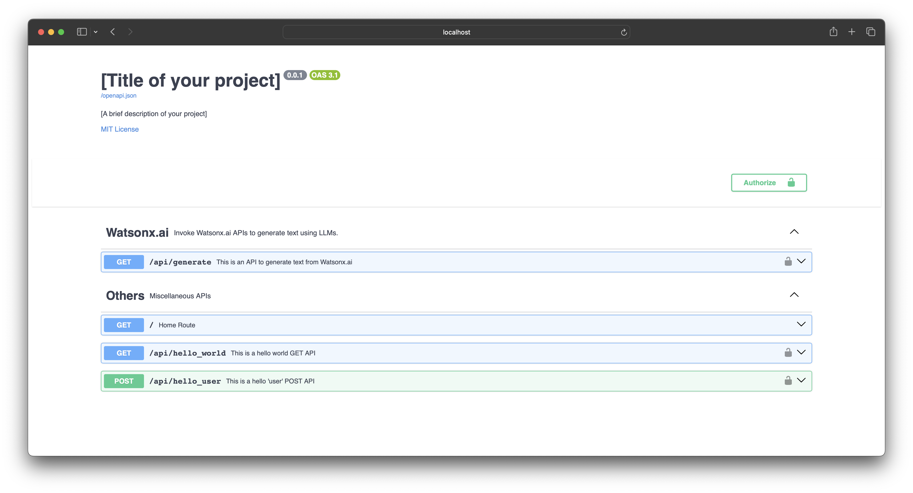
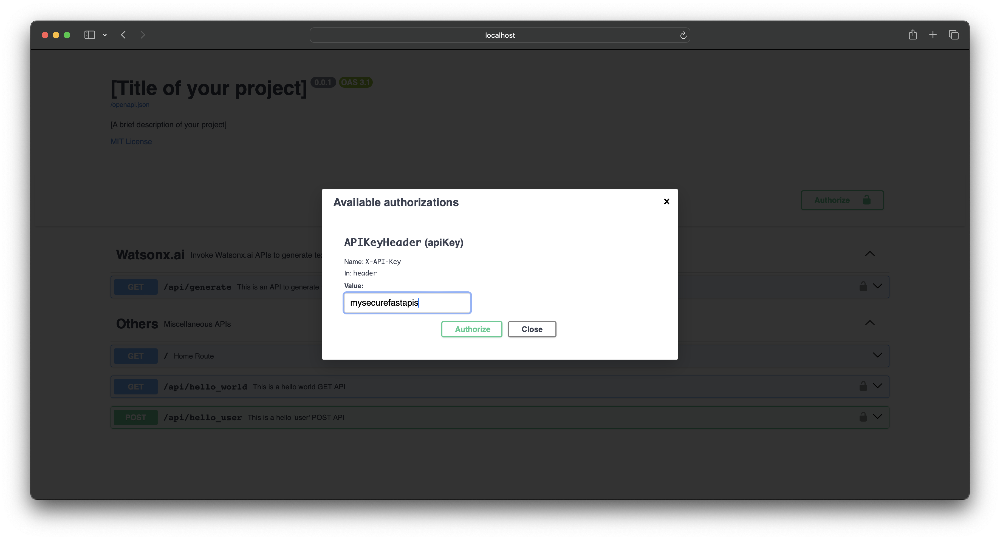
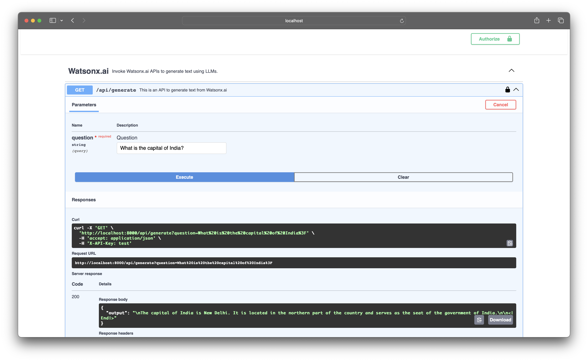
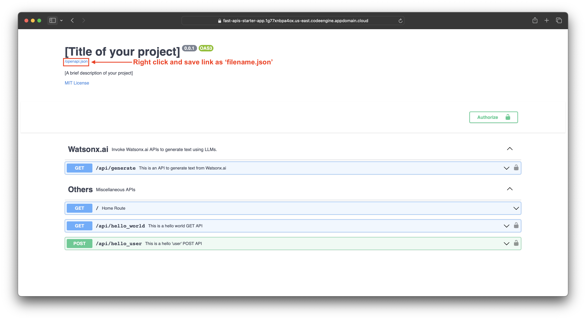
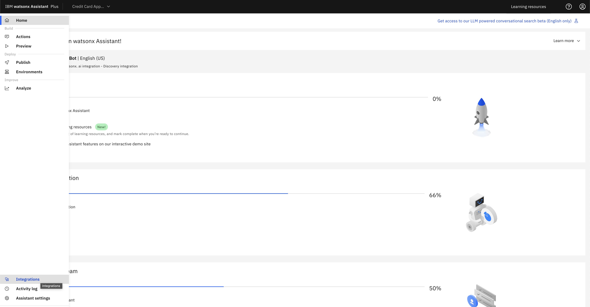
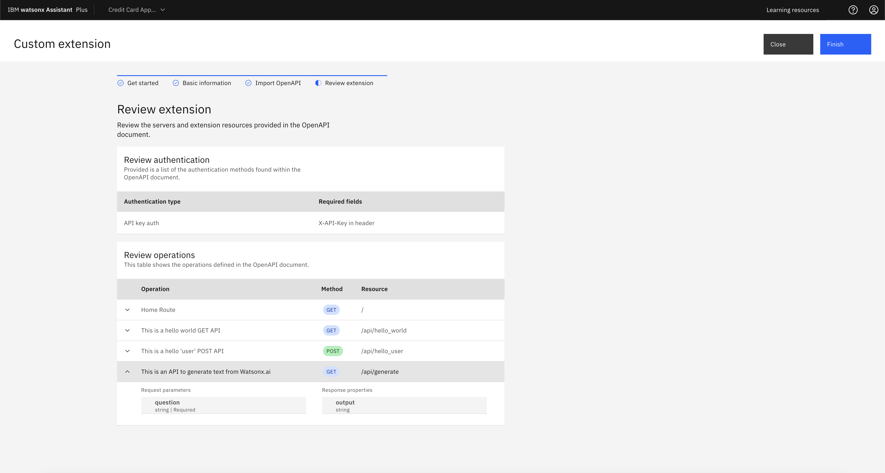
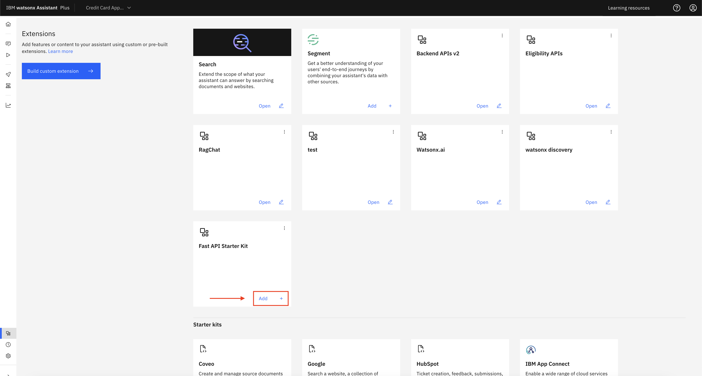
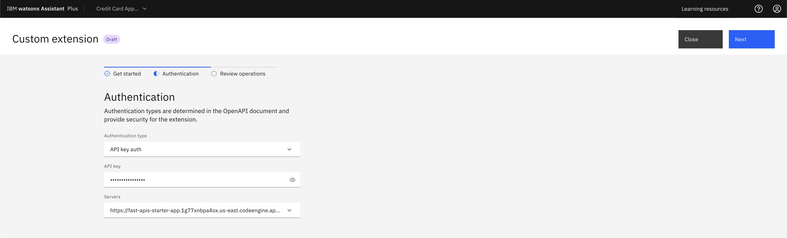
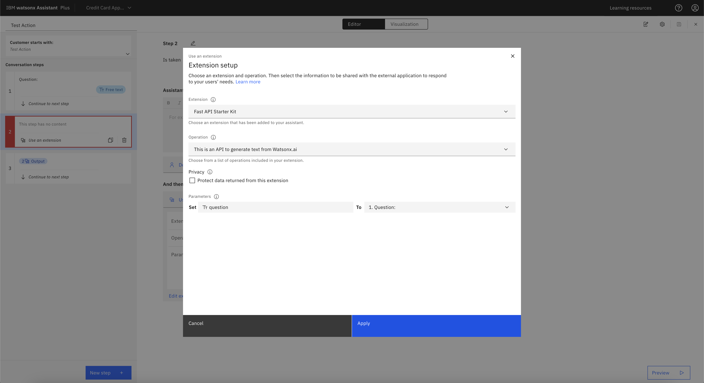

# FastAPI watsonx assistant custom extension

This is a python Fast API starter-kit to quick start API development.

[FastAPI](https://fastapi.tiangolo.com/) is a modern, fast (high-performance), web framework for building APIs with Python. The performance of Fast API is on par with NodeJS and Go. The best part, you need not write OpenAPI Spec json file, FastAPIs provide OpenAPI spec json and a SwaggerUI built in. Learn more about Fast API [here](https://fastapi.tiangolo.com/tutorial/).

You may have a question, **How does it compare with Django & Flask frameworks for developing APIs in python?**

Django suits larger, feature-rich applications, while Flask offers simplicity and flexibility for smaller projects. FastAPI excels in high-performance APIs and real-time applications, particularly for projects with high concurrency needs.

Reference link: [Django, Flask, FastAPI: A Comparative Analysis of Python Web Frameworks](https://www.capitalnumbers.com/blog/django-vs-flask-vs-fastapi/#:~:text=Django%20suits%20larger%2C%20feature%2Drich,projects%20with%20high%20concurrency%20needs.)


## Table of content

1. [Run the FastAPIs locally](#1-run-the-fastapis-locally)
1. [Project Structure](#2-project-structure)
1. [Deploy the FastAPIs on Code Engine](#3-deploy-the-fastapis-on-code-engine)
1. [Integrate the FastAPIs with Watsonx Assistant as a Custom Extension](#4-integrate-the-fastapis-with-watsonx-assistant-as-a-custom-extension)
1. [References](#references)


## 1. Run the FastAPIs locally

1. Clone the repo. In terminal run,

    ```bash
    git clone https://github.com/manojjahgirdar/fastapi-watsonx-assistant-custom-extension.git
    ```

2. Goto the root of the cloned repo and install the python dependencies.
    - Navigate to the root of the cloned repo,

        ```bash
        cd your-repo/
        ```

    - Create a python virtual environment,

        ```bash
        virtualenv venv
        source venv/bin/activate
        ```

    - Install the python dependencies,

        ```bash
        pip install -r requirements.txt
        ```

3. Export environment varibles and run the application.
    - Export the environment variables,

        ```bash
        export API_KEY="mysecurefastapis" # This will be used to authenticate the APIs
        export IBM_CLOUD_API_KEY=<your IBM CLOUD API Key> # This is your IBM Cloud API Key used to authenticate watsonx.ai 
        export WX_PROJECT_ID=<your watsonx Project ID> # This is your watsonx.ai project id
        export WX_ENDPOINT=<your watsonx endpoint> # example: https://us-south.ml.cloud.ibm.com
        ```

    - Run the application,

        ```bash
        uvicorn main:app --reload
        ```

4. The application will be running on: <http://127.0.0.1:8000/docs>
    

5. To try out the APIs, click on **Authorize** and enter the API Key that you exported in your environment. For example in previous step we exported `API_KEY="mysecurefastapis"` hence enter the API Key as **"mysecurefastapis"**.
    

6. There is one API created to generate from watsonx.ai foundation models.
    1. `/api/generate`: This is a GET api that takes a query param named `question: string` and returns the output. Internally, the business logic is the `question` is sent to watsonx llm to get the output.
    

>Note: You can keep the server running and make changes to the code, upon saving the file the server will reload automatically since we have used the `--reload` flag.

## 2. Project Structure

The project structure looks something like this:

```bash
fastapis-custom-extension
├── Dockerfile
├── README.md
├── apis
│   ├── watsonx_generate_apis.py
│   └── __init__.py
├── config.json
├── main.py
├── requirements.txt
└── src
    ├── watsonx_generate.py
    └── __init__.py
```

1. **src** directory will contain all the business logic of your application
2. **apis** directory will contain all the API routers, controllers.
3. **main.py** is the entrypoint to start the FastAPI application.
4. **config.json** is the configuration file to set your project title, description etc. that appears on the SwaggerUI Docs.
5. **requirements.txt** contains the python dependencies that needs to be installed before launching the application.
6. **Dockerfile** contains instructions for building a Docker image, which is a file used to run code in a Docker container.

## 3. Deploy the FastAPIs on Code Engine

Once your developement is completed, you can build a Container Image and deploy it on Code Engine.

1. Build Container Image by running the following command in terminal,
    ```bash
    podman build --platform=linux/amd64 -t fast-apis-starter-kit:1.0 .
    ```
    >Note: The `--platform=linux/amd64` flag is required if you are building the image from a M1 silicon MacBook.

2. Create a namespace in [IBM Cloud Container Registry](https://cloud.ibm.com/registry/start).
    <details><summary><strong>Install Container Registry Plugin Command</strong></summary>

    ```bash
    ibmcloud plugin install container-registry -r 'IBM Cloud'
    ```
    </details>

    ```bash
    ibmcloud login --sso
    ```

    ```bash
    ibmcloud target -g Default -r us-east
    ```
    
    ```bash
    ibmcloud cr region-set us-south
    ```

    ```bash
    ibmcloud cr namespace-add <my_namespace>
    ```
    
    ```bash
    ibmcloud cr login
    ```

3. Tag the image with registry namespace prefix.
    ```bash
    podman tag fast-apis-starter-kit:1.0 us.icr.io/<my_namespace>/fast-apis-starter-kit:1.0
    ```

4. Push the image to IBM Cloud Container Registry.
    ```bash
    podman push us.icr.io/<my_namespace>/fast-apis-starter-kit:1.0
    ```

5. Create a Code Engine Project.
    <details><summary><strong>Install Code Engine Plugin Command</strong></summary>

    ```bash
    ibmcloud plugin install code-engine
    ```
    </details>
    
    ```bash
    ibmcloud ce project create --name <Project Name>
    ```

6. Select the newly created project.
    ```bash
    ibmcloud ce project select --name <Project Name>
    ```

7. Create the secrets in Code Engine. Create a `.env` file in the root directoy of the repo and add the environment variables `API_KEY`, `IBM_CLOUD_API_KEY` & `PROJECT_ID` and save it.
    
    - Run the following command in terminal to copy the env variables to `.env` file:
        ```bash
        env | grep API_KEY >> .env && env | grep WX_ >> .env
        ```

    - You should see a **.env** file created with content:
        ```
        API_KEY="mysecurefastapis"
        IBM_CLOUD_API_KEY=<your IBM CLOUD API Key>
        WX_PROJECT_ID=<your watsonx Project ID>
        WX_ENDPOINT=<your watsonx endpoint>
        ```

    - Create secret in Code Engine with this **.env** file.
        ```bash
        ibmcloud ce secret create --name fast-api-secrets --from-env-file .env
        ```

8. Create another secret to access the IBM Cloud Container Registry. This will be your `IBM_CLOUD_API_KEY` that will be used as Image Pull secret by the Code Engine.

    ```bash
    ibmcloud ce secret create --format registry --name us-icr-io-creds --server us.icr.io --username iamapikey --password $IBM_CLOUD_API_KEY
    ```

9. Deploy the FastAPIs to Code Engine.
    ```bash
    ibmcloud ce app create --name <App Name> \
    --image us.icr.io/<my_namespace>/fast-apis-starter-kit:1.0 \
    --min-scale 0 \
    --env-from-secret fast-api-secrets \
    --registry-secret us-icr-io-creds
    ```

10. You will see an URL where you will be able to access the deployed FastAPIs. Add `/docs` at the end of the URL to open the SwaggerUI Docs.

- Example URL: <https://fast-apis-starter-app.1g77xnbpa4ox.us-east.codeengine.appdomain.cloud/docs>

## 4. Integrate the FastAPIs with Watsonx Assistant as a Custom Extension

Once the FastAPI is deployed on Code Engine, you can download the OpenAPI spec json file and create an Watsonx Assistant Extension out of it.

1. Right click on the `OpenAPI.json` in the SwaggerUI and download it.
    

2. Open the downloaded OpenAPI json file and add the server details to it as shown.

    - Add the following:

        ```json
        "servers": [
                {
                    "url": "<your-code-engine-url>"
                }
        ]
        ```

    - As shown:

        <pre>
        {
            "openapi": "3.0.2",
            "info": {
                "title": "[Title of your project]",
                "description": "[A brief description of your project]",
                "license": {
                    "name": "MIT License",
                    "url": "https://opensource.org/licenses/MIT"
                },
                "version": "0.0.1"
            },
            <b>"servers": [
                {
                    "url": "your-code-engine-url"
                }
            ],</b>
            "paths": {
                "/": {
                    "get": {
                        . . .
        }
        </pre>

3. Launch your Watsonx Assistant, Open your Assistant. Select **Integrations**.
    

4. Click on **Build Custom Entensions**, Enter a name for the Extension, and upload the OpenAPI spec file that you downloaded in the previous step. Finally review the extension. You can see all the API details is detected by Watsonx Assistant. Click on **Finish**.
    

5. You will see the extension, click on **Add**.


6. Select the Authentication type as **API key auth** and enter the `API_KEY` to authenticate the APIs. Click on **Next**, review and **Finish**.
    

7. In the assistant action, select **Use an Extention** option at the dilog flow and configure the Extension.
    

8. You should be able to invoke your extension from your Watsonx Assistant.
    

## References

1. [FastAPI Tutorial - User Guide](https://fastapi.tiangolo.com/tutorial/)
1. [IBM Cloud Container Registry Guide](https://cloud.ibm.com/registry/start)
1. [IBM Code Engine Guide](https://cloud.ibm.com/docs/codeengine)
1. [Watson Assistant - Building a custom extension](https://cloud.ibm.com/docs/watson-assistant?topic=watson-assistant-build-custom-extension)
